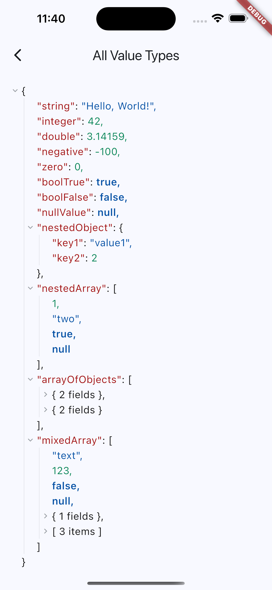
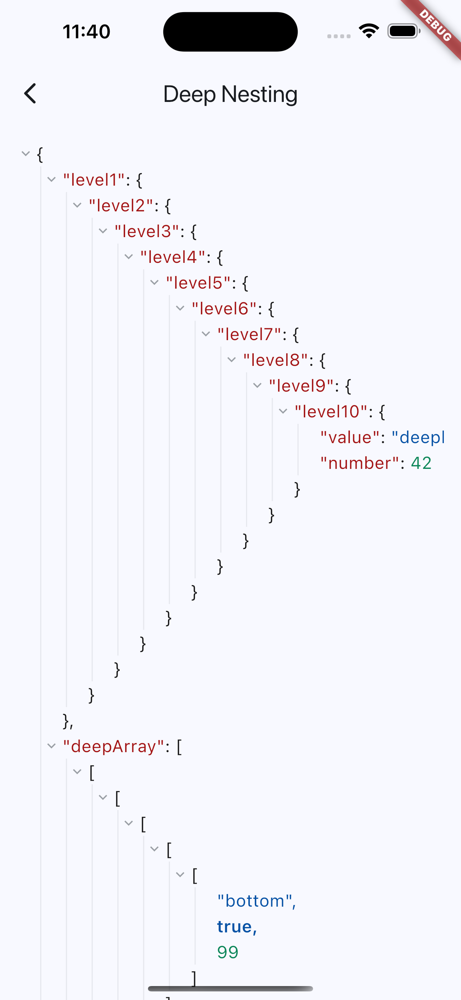
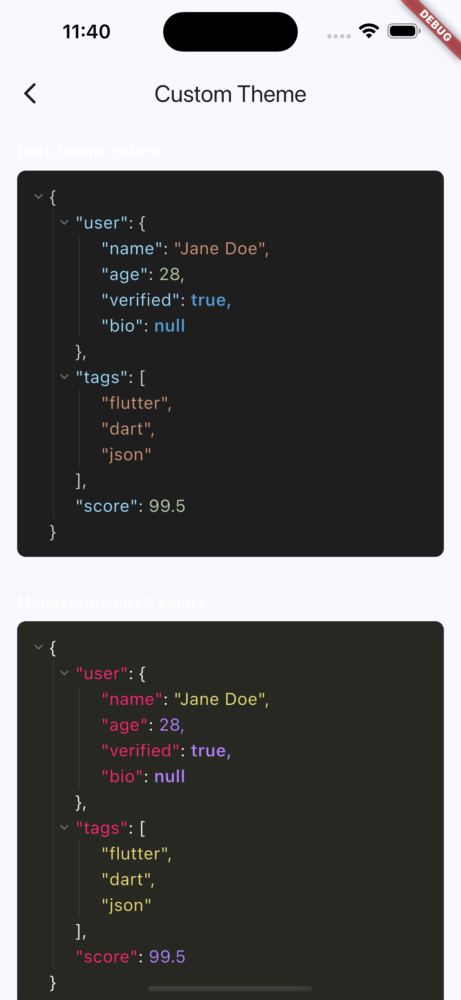
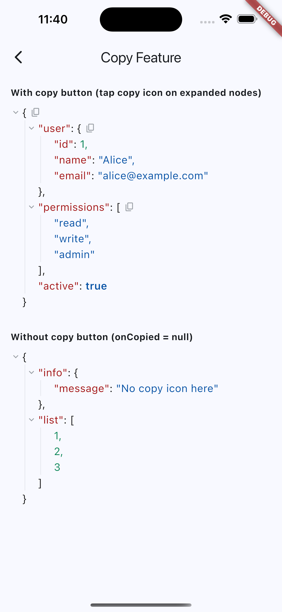

# JSON Visualizer

A Flutter widget for displaying JSON data as an interactive tree view with syntax highlighting, expand/collapse, and copy-to-clipboard.

## Screenshots

| All Value Types | Copy Node |
|:-:|:-:|
|  |  |

| Custom Theme | Deep Nesting |
|:-:|:-:|
|  |  |

## Features

- Expand/collapse nodes with animated transitions
- Syntax highlighting (keys, strings, numbers, booleans, null)
- Easily customize theme and layout
- Copy any node's JSON to clipboard
- Lazy rendering with pagination for large collections (100+ items)
- Indent guide lines for nested levels

## Getting started

```yaml
dependencies:
  json_visualizer: ^0.0.1
```

## Usage

```dart
import 'package:json_visualizer/json_visualizer.dart';

// Basic
JsonVisualizer(
  data: {'name': 'Alice', 'age': 25, 'active': true},
)

// From raw JSON string
JsonVisualizer(
  data: '{"name":"Alice","scores":[95,87,92]}',
)

// Full customization
JsonVisualizer(
  data: myJsonData,
  expandDepth: 2,
  fontSize: 14,
  indentWidth: 20,
  colors: JsonVisualizerColors(
    key: Color(0xFF9CDCFE),
    string: Color(0xFFCE9178),
    number: Color(0xFFB5CEA8),
    boolean: Color(0xFF569CD6),
    nullValue: Color(0xFF569CD6),
    bracket: Color(0xFFD4D4D4),
    icon: Color(0xFF6A737D),
  ),
  onCopied: () => print('Copied!'), // null to hide copy buttons
)
```

See [`example/`](example/) for all use cases.